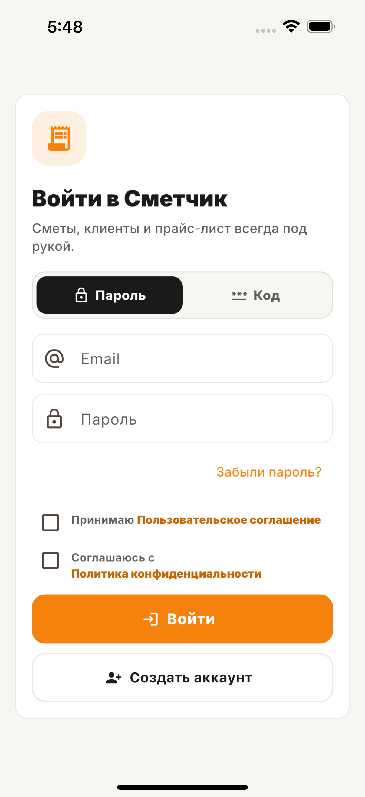
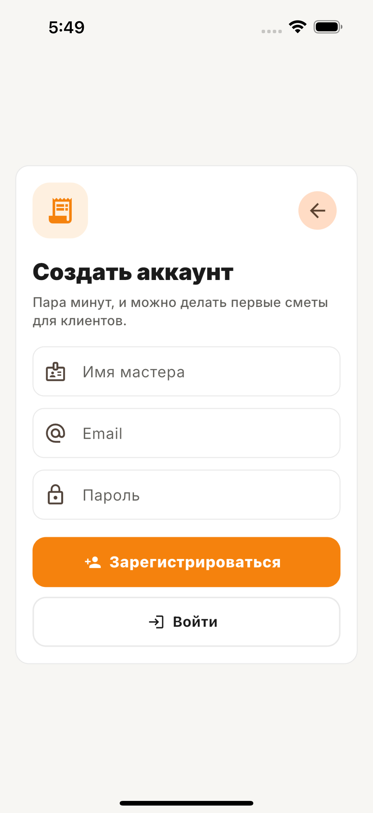

<p align="center">
  
</p>

<h1 align="center">Сметчик</h1>

<p align="center">
  Рабочий инструмент мастера для быстрых смет, клиентов, прайс-листа и PDF прямо на объекте.
</p>

<p align="center">
  <a href="https://smetchik.pages.dev/">
    
  </a>
  <a href="#быстрый-старт">
    
  </a>
</p>

<p align="center">
  
  
  
  
</p>

---

## Что это

**Сметчик** помогает сантехникам, электрикам, отделочникам, монтажникам и частным строительным бригадам подготовить понятную смету за несколько минут, отправить её клиенту в PDF и следить за работой по объектам.

Продукт сделан mobile-first: крупные зоны касания, нижняя навигация, минимум полей и нормальный сценарий работы одной рукой. На широком экране интерфейс перестраивается в рабочий desktop-layout с верхними вкладками.

## Экраны

<p align="center">
  
  
</p>

<p align="center"><sub>Чистые скриншоты iOS-версии: вход и создание аккаунта.</sub></p>

## Возможности MVP

| Раздел | Что уже работает |
| --- | --- |
| **Сметы** | Работы, количество, цена, статусы, дублирование, история версий и блокировка после подписания. |
| **PDF** | Коммерческое предложение с шаблонами, цветом, логотипом, росписями, QR-кодом оплаты и настройками Профи. |
| **Подписание** | Клиент открывает смету по QR-ссылке, подтверждает условия и оставляет роспись. Финальный PDF и метаданные подписи сохраняются отдельно. |
| **Прайс-лист** | Категории с иконками, собственные услуги, редактирование цен, поиск и отправка прайс-листа. |
| **Клиенты** | Контакты, телефон с российским форматом, адрес с подсказками, комментарии и история смет. |
| **Объекты** | Внутренний учёт стройки: план, расходы, поступления, прибыль, экспорт PDF и Excel. |
| **Офлайн** | Кэш ранее открытых данных; новые сметы и объекты сохраняются на устройстве и автоматически синхронизируются после восстановления сети. |
| **Доступ** | Email + пароль, вход кодом, восстановление пароля, подготовленная Telegram-авторизация. |
| **Промокоды** | Активация Профи по одноразовым или лимитированным кодам с серверной проверкой и журналом. |

> Подписанные сметы не меняются офлайн намеренно: это защищает финальный документ и юридическую историю.

## Платформы

| Платформа | Статус |
| --- | --- |
| Web / PWA | Публикуется через Cloudflare Pages, устанавливается на домашний экран. |
| Android | Нативная Flutter-сборка, готовится `AAB` для Google Play. |
| iOS | Нативный target подготовлен; публикация в App Store требует Apple Developer Program и релизной процедуры. |

## Технологии

- **Flutter / Dart**: единая кодовая база для web, Android и iOS.
- **Supabase**: Auth, PostgreSQL с RLS, Storage и Edge Functions.
- **Riverpod + GoRouter**: состояние и маршрутизация.
- **pdf + printing + share_plus**: генерация, просмотр и передача PDF.
- **Cloudflare Pages**: веб-деплой из ветки `main`.
- **SharedPreferences**: локальный кэш и очередь офлайн-черновиков.

## Быстрый старт

```bash
git clone https://github.com/AxelBl1ze/smetchik.git
cd smetchik
flutter pub get
flutter run -d chrome
```

Для запуска с другим проектом Supabase передайте публичные параметры сборки:

```bash
flutter run -d chrome \
  --dart-define=SUPABASE_URL=https://PROJECT_REF.supabase.co \
  --dart-define=SUPABASE_ANON_KEY=YOUR_SUPABASE_PUBLISHABLE_KEY
```

Не добавляйте service role key, SMTP-пароли, ключи UniSender, Telegram или DaData в клиентский код и в Git. Такие данные должны лежать только в Supabase Secrets или секретах CI.

## Проверка качества

```bash
flutter analyze
flutter test
flutter build web --release
```

## Деплой Web / PWA

Проект рассчитан на Cloudflare Pages. Скрипт [scripts/cloudflare_build.sh](scripts/cloudflare_build.sh) устанавливает Flutter stable, получает зависимости и собирает `build/web`.

В Cloudflare Pages укажите:

| Поле | Значение |
| --- | --- |
| Build command | `bash scripts/cloudflare_build.sh` |
| Build output directory | `build/web` |
| Production branch | `main` |

Переменные окружения для production и preview:

```text
SUPABASE_URL=https://PROJECT_REF.supabase.co
SUPABASE_ANON_KEY=YOUR_SUPABASE_PUBLISHABLE_KEY
PUBLIC_APP_URL=https://YOUR_DOMAIN
```

После подключения репозитория к Cloudflare Pages каждый push в `main` запускает новую сборку автоматически.

## Витрина и админка

В репозитории три независимые сборки, но это **один проект**: общий Supabase, миграции и единая история изменений. Для них удобно завести три Cloudflare Pages-проекта с разными адресами:

| Проект Pages | Назначение | Build command | Output directory |
| --- | --- | --- | --- |
| `smetchik-app` | Приложение мастера / PWA | `bash scripts/cloudflare_build.sh` | `build/web` |
| `smetchik-site` | Публичная витрина продукта | `bash scripts/cloudflare_build_marketing.sh` | `build/marketing` |
| `smetchik-admin` | Закрытая админ-панель | `bash scripts/cloudflare_build_admin.sh` | `build/admin` |

Для админки нужны те же публичные переменные `SUPABASE_URL` и `SUPABASE_ANON_KEY`. Service role key в Cloudflare Pages не добавляется: он остаётся только внутри Supabase Edge Functions.

Админка требует обычный вход по email и паролю, а затем проверяет роль на сервере. Первый администратор - пользователь с email `ilyasidnev.qa@gmail.com`: после регистрации или первого входа этим адресом триггер выдаст ему роль. Обычный переход по адресу админки без роли не открывает данные.

## Supabase

Миграции лежат в [supabase/migrations](supabase/migrations), Edge Functions - в [supabase/functions](supabase/functions).

```bash
SUPABASE_TELEMETRY_DISABLED=1 supabase link \
  --project-ref PROJECT_REF \
  --password STRONG_PASSWORD

SUPABASE_TELEMETRY_DISABLED=1 supabase db push
```

Используемые Edge Functions:

- `suggest-addresses` - подсказки адресов по России;
- `send-auth-email` - письма с кодами доступа;
- `telegram-auth` - вход и подтверждение через Telegram;
- `estimate-signature-otp` - проверка клиента перед подписью;
- `estimate-approval` - публичная страница принятия сметы по QR-ссылке.
- `redeem-promo` - безопасная активация промокода для текущего пользователя;
- `admin-console` - закрытые операции админки: промокоды, тарифы, журнал и экспорт доказательств подписания.

## Структура

```text
lib/src/
  features/       # экраны и пользовательские сценарии
  data/           # Supabase, PDF, экспорт, кэш и офлайн-синхронизация
  shared/         # общие UI-компоненты и форматтеры
  core/           # тема, конфигурация и контроллеры
supabase/
  migrations/     # схема БД и RLS
  functions/      # Edge Functions
docs/screenshots/ # скриншоты для README
scripts/          # сборка Cloudflare Pages
marketing/        # лёгкая публичная сайт-витрина
lib/admin_main.dart # отдельная точка входа админ-панели
```

## Что дальше

- боевой биллинг Профи и серверная проверка платежей;
- резервный экспорт данных мастера;
- публикация Android в Google Play и подготовка iOS-релиза.

---

<p align="center"><b>Сметчик</b> - меньше таблиц, больше работы на объекте.</p>
